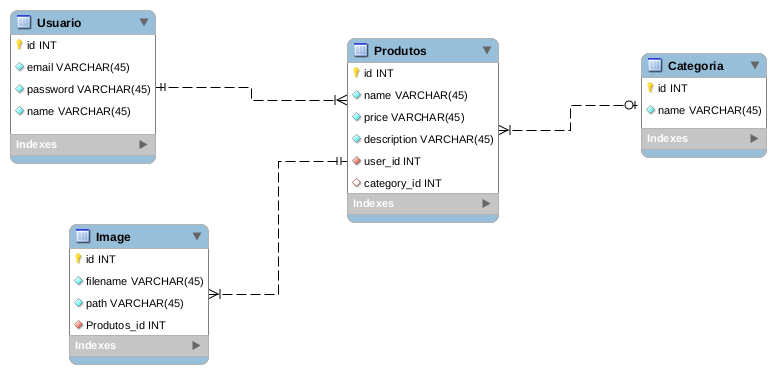

# Teste-Back-End---Mateus

## Tabela de Conteúdo
- [Overview](#overview)
  - [Screenshot](#screenshot) 
- [Documentação](#documentação)
  - [Instalação](#instalação)
  - [Rotas](#rotas)
    - [User](#user)
    - [Product](#product)
    - [Category](#category)
    - [Image](#image)

## Overview
Um resumo do projeto:
<ul>
  <li>Realizar CRUD através das rotas da API (GET, POST, PUT, DELETE)</li>
  <li>Login/Autenticação JWT</li>
  <li>Persistencia no banco de dados</li>
  <li>Utilização de .ENV para ocultação de dados sensíveis</li>
  <li>Upload de imagens</li>
  <li>Migrations para documentação do banco</li>
  <li>Seeds de dados</li>
</ul>

### Ferramentas utilizadas
<ul>
  <li>Javascript</li>
  <li>Node.js</li>
  <li>Express.js</li>
  <li>Sequelize</li>
  <li>Multer</li>
  <li>JWT</li>
  <li>BCrypt</li>
  <li>Dotenv (.env)</li>
  <li>mysql2 (Driver de acesso ao banco MySQL)</li>
  <li>Yarn (Gerenciador de dependências)</li>
  <li>Nodemon (Auto reload)</li>
</ul>

## Screenshot



## Documentação

### Instalação

Após clonar o repositório, abra o terminal dentro do diretório do projeto e execute o comando abaixo para baixar as dependências necessárias

```javascript
npm install
```
Rode os comandos abaixo para executar as Migrations e em seguida as Seeds

```javascript
npx sequelize-cli db:migrate
```

```javascript
npx sequelize-cli db:seed:all
```

Execute o comando a seguir para iniciar a API

```javascript
npm start
```
Ou

```javascript
node server.js
```

### Rotas

Rotas existentes para essa API:

#### User

| Método| Rota |Descrição|Token JWT|
|------|-------|---------|----------
| GET  |`/user`| Retorna dados em formato JSON de todos os usuários cadastrados | Não |
| GET  |`/user/:id`| Retorna um usuário especifico em formato JSON utilizando o parametro "id" na requisicao | Não |
| POST |`/user` | Enviar dados através do corpo da requisição e os persiste no banco da dados como um novo usuário | Sim |
| POST |`/user/authentication` | Rota utilizada para realizar login com base nos dados passados no corpo da requisição | Não
| PUT |`/user` |  Altera dados de um usuário já existente no banco de dadas através de um novo corpo passado na requisição | Sim |
| DELETE |`/user` | Delete uma pessoa com base no seu ID passado no corpo da requisição | Sim |

#### Product

| Método| Rota |Descrição|Token JWT|
|------|-------|---------|----------
| GET  |`/product`| Retorna dados em formato JSON de todos os produtos cadastrados | Não |
| GET  |`/product/:id`| Retorna um produto especifico em formato JSON utilizando o parametro "id" na requisicao | Não |
| POST |`/product` | Enviar dados através do corpo da requisição e os persiste no banco da dados como um novo produto | Sim |
| PUT |`/product` |  Altera dados de um produto já existente no banco de dadas através de um novo corpo passado na requisição | Sim |
| DELETE |`/product` | Delete um produto com base no seu ID passado no corpo da requisição | Sim |

#### Category

| Método| Rota |Descrição|Token JWT|
|------|-------|---------|----------
| GET  |`/category`| Retorna dados em formato JSON de todas as categorias cadastradas | Não |
| GET  |`/category/:id`| Retorna uma categoria especifico em formato JSON utilizando o parametro "id" na requisicao | Não |
| POST |`/category` | Enviar dados através do corpo da requisição e os persiste no banco da dados como uma nova categoria | Sim |
| PUT |`/category` |  Altera dados de uma categoria já existente no banco de dadas através de um novo corpo passado na requisição | Sim |
| DELETE |`/category` | Delete uma categoria com base no seu ID passado no corpo da requisição | Sim |

#### Image

| Método| Rota |Descrição|Token JWT|
|------|-------|---------|----------
| GET  |`/images/product/:product_id`| Retorna dados JSON de todas as imagens referente a um produto com base no "id" | Não |
| GET  |`/images/product/uploads/:filename`| Retorna dados de uma imagem especifica em JSON utilizando o nome da imagem | Não |
| POST |`/images/product` | Enviar dados/imagem e o id do produto a ser atrelado, para em seguida, salvar dados no banco e realizar o upload | Sim |
| PUT |`/images/product/uploads/:filename` |  Altera "id" do produto que a imagem está atrelada com base no corpo da requisiçãode | Sim |
| DELETE |`/images/product/uploads/:filename` | Delete uma imagem com base no seu nome | Sim |

